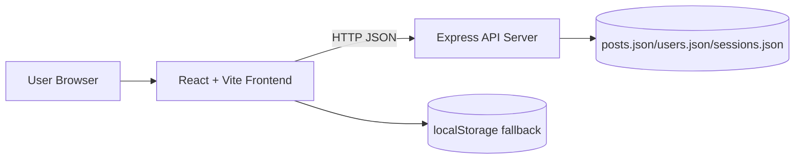
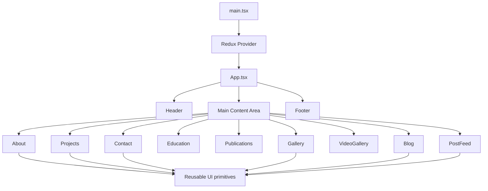
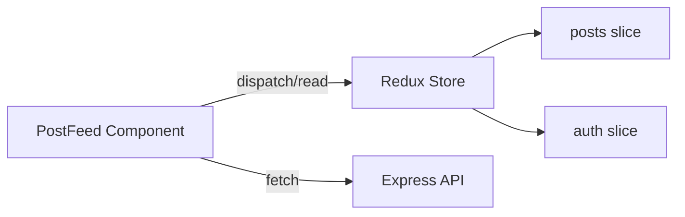

# Component-Based Architecture - Digital Portfolio

This document describes the frontend and optional backend architecture of the portfolio project.

## 1. Architecture Style
- Pattern: Component-based SPA shell
- Frontend composition: Feature sections rendered by application state
- State model: Global Redux store for auth and posts domain
- Data source strategy:
  - Static sections are component-local data
  - Dynamic post feed uses backend API with localStorage fallback

## 2. High-Level System View

## 3. Frontend Composition

## 4. App Shell and Navigation
- App shell is defined by App.tsx.
- Header raises navigation events via an onNavigate callback.
- App.tsx keeps the current page in local component state and switches feature components.
- Footer is always rendered.

Implication:
- Navigation is state-driven, not URL-driven.
- This keeps implementation simple, but deep linking and browser history are limited.

## 5. Component Layers

### 5.1 Page/Feature Components
- About, Projects, Contact, Education, Publications
- Gallery, VideoGallery, Blog
- PostFeed (interactive content + data operations)

### 5.2 Shared Presentation Components
- UI building blocks under src/components/ui
- Examples: Card, Button, Dialog, Input, Badge, Tabs, Popover
- Purpose: consistent look and reduced duplicated markup

### 5.3 Utility Components
- figma/ImageWithFallback.tsx: resilient image rendering abstraction

## 6. State Architecture

### 6.1 Store
- Root store in src/store/store.ts
- Registered reducers:
  - posts
  - auth

### 6.2 posts slice responsibilities
- Hold post list in memory
- Add/update posts
- Add comments
- Toggle likes

### 6.3 auth slice responsibilities
- Hold username/token session data in client state
- Login/logout actions

## 7. Data Flow in PostFeed

### 7.1 Read flow
1. PostFeed mounts.
2. Attempts GET /posts.
3. If API is available:
- Merge API posts with any local-only posts.
- Push merged list into Redux.
4. If API is unavailable:
- Load post data from localStorage.
- Push local data into Redux.

### 7.2 Write flow (create post)
1. User submits post form.
2. Client tries POST /posts with auth token.
3. On success:
- Refresh feed from API.
4. On failure:
- Save post as local-only entry in localStorage.
- Dispatch local add action to keep UI responsive.

### 7.3 Interaction flow (likes/comments)
- Likes/comments are attempted against API first.
- Fallback path updates local state and localStorage when API is unavailable.

## 8. Backend Architecture (Optional)
- Runtime: Node.js + Express
- Persistence: JSON files in server folder
- Authentication: simple token mapping in sessions.json
- CORS: open for local development usage

### API surface
- GET /posts
- POST /posts
- DELETE /posts/:id
- POST /posts/:id/comments
- POST /posts/:id/likes
- POST /auth/register
- POST /auth/login

## 9. Build and Deployment Architecture
- Bundler: Vite
- Frontend output: build/
- Hosting target: GitHub Pages
- Base path configured for repository deployment: /Salim-Saay/

## 10. Extension Points
- Replace state-based page switching with react-router for deep links.
- Move hardcoded section datasets into typed content modules.
- Replace JSON-file backend with persistent database service.
- Add API client abstraction layer to isolate fetch logic from UI components.
- Add unit/integration tests around store reducers and PostFeed network behavior.

## 11. Risks and Constraints
- No URL routing can affect SEO and direct page linking.
- JSON-file backend is not suitable for production-grade concurrency.
- Client fallback strategy can create temporary divergence between local and remote posts.

## 12. Recommended Refactor Roadmap
1. Introduce route-driven navigation while preserving current component structure.
2. Extract PostFeed API calls into service module.
3. Add typed DTO contracts shared between client and server.
4. Add tests for reducers and PostFeed offline behavior.
5. Harden auth and password handling if server is promoted beyond demo scope.
